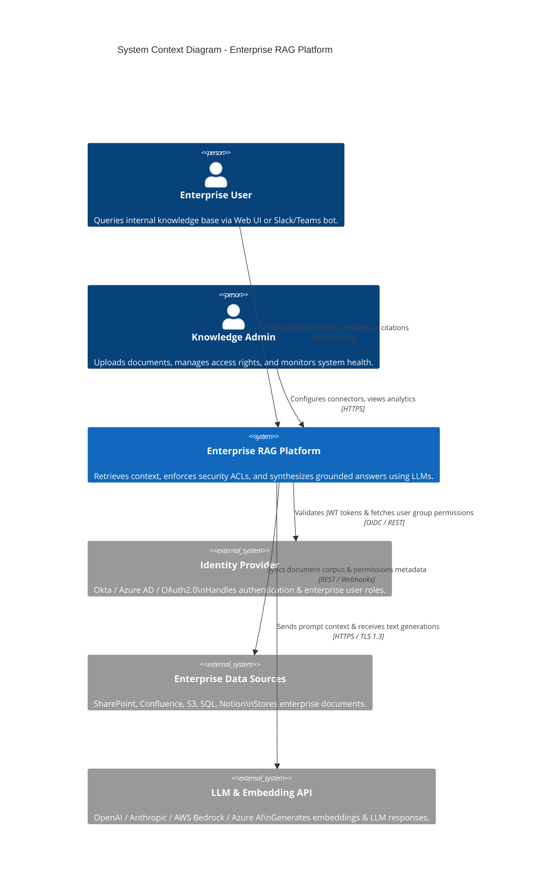
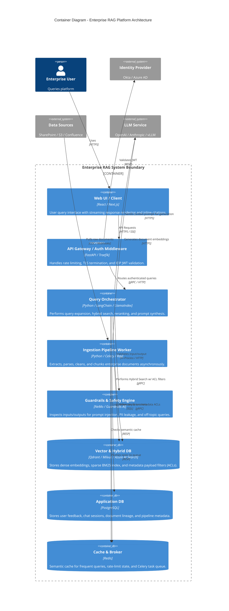
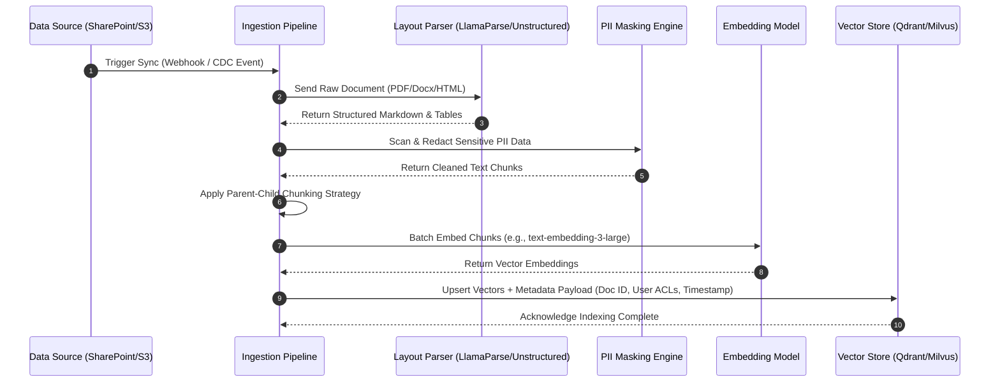
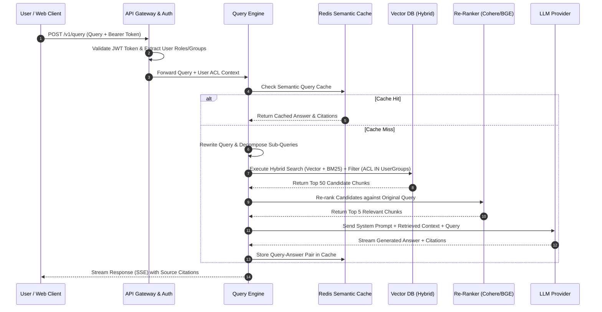

# High-Level Design (HLD) - Enterprise RAG Platform

## 1. System Context Diagram (C4 Level 1)

This diagram shows how actors (End Users and System Administrators) interact with the Enterprise RAG System and its boundary integration with external enterprise systems (Identity Providers, Data Sources, and LLM Providers).

## 2. Container Diagram (C4 Level 2)

This diagram breaks down the system boundary into microservices, data stores, vector indexes, and asynchronous processing workers.

## 3. Data Flow & Execution Sequences

### 3.1 Ingestion & Indexing Data Flow

### 3.2 Query Processing & RAG Retrieval Sequence

