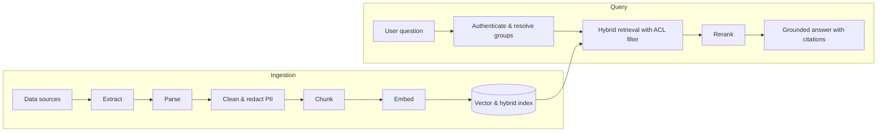

# Telco RAG Documentation

## System Overview

**Telco RAG** is a retrieval-augmented generation (RAG) platform for telecom domain
knowledge. It ingests documents from enterprise sources, converts them into
permission-aware vector + keyword indexes, and answers user questions with grounded,
cited responses.

The platform is built around two pipelines:



- **Ingestion** runs asynchronously: documents are pulled from sources, parsed into
  structured text, scrubbed of PII, split into chunks, embedded, and upserted together
  with their ACL metadata.
- **Query** runs synchronously per request: the caller is authenticated, their groups
  are resolved, retrieval is executed with an ACL filter applied in the index query,
  candidates are reranked, and the LLM synthesizes an answer from the retrieved context.

Design documents covering containers, data flow, and API contracts are being written
into the sections below.

## Repository Layout

| Path | Purpose |
| --- | --- |
| `src/` | Application and pipeline source code |
| `data/raw/` | Raw ingested documents (local working copy) |
| `docs/` | This documentation set, built with MkDocs |
| `PLAN.md` | Delivery plan and milestones |
| `CHANGELOG.md` | Notable changes per release |

## Documentation Structure

| Section | Page | Contents |
| --- | --- | --- |
| 01 Architecture | `index.md` | System design, API specification, vector schema, infrastructure topology, high- and low-level design |
| 02 Data Pipeline | `index.md` | Connectors inventory, parsing and chunking, data lineage catalog, re-indexing runbook |
| 03 Security & Compliance | `index.md` | Access control and ACLs, PII data protection, threat model, audit logging policy |
| 04 Evaluation & Quality | `index.md` | Evaluation framework, golden dataset guide, system prompts and guardrails |
| 05 Operations | `index.md` | Deployment and CI/CD, observability and monitoring, incident response, capacity and cost |
| 06 Developer Guides | `index.md` | Quickstart SDK, end-user guide, changelog |

## Working With These Docs

```bash
# Serve the documentation site locally with live reload
mkdocs serve -f docs/mkdocs.yml

# Build the static site into ./site
mkdocs build -f docs/mkdocs.yml --strict
```

The navigation tree lives in `docs/mkdocs.yml`. Sections appear in the nav as their
pages are authored.
